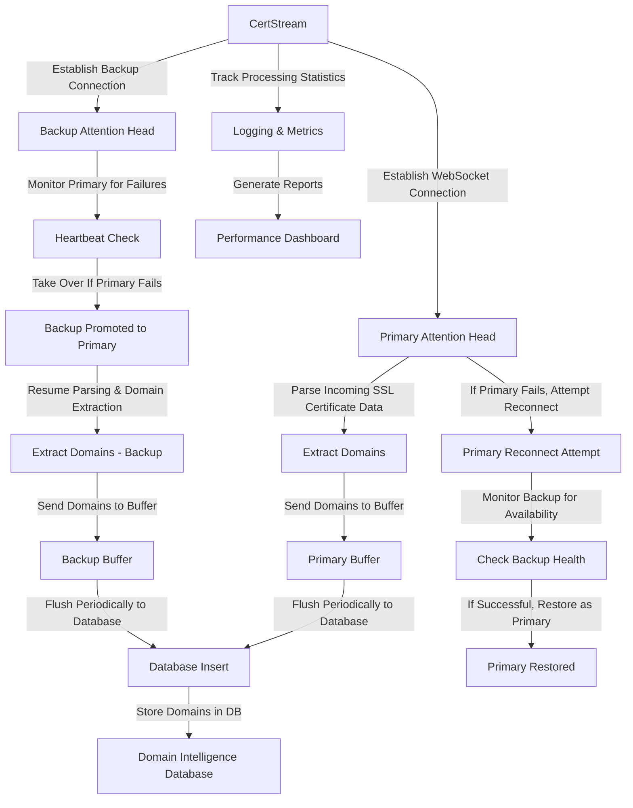
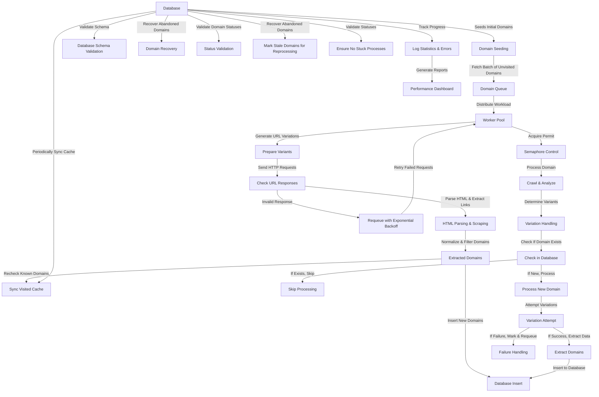

AGNB Omnirepo
=============

Welcome to the **AGNB Omnirepo**, a unified repository containing multiple projects focused on analytics, research, scraping, and automation. Each project within this repository serves a unique purpose, leveraging different technology stacks and dependencies. Below is an overview of each project, its concept, stack, and links to its respective documentation.


📜 Project Overview
-------------------

### 🟡 ADHOC Projects

#### 1️⃣ ADHOC-research

-   **Concept:** Miscellaneous scripts for exploratory analysis.
-   **Stack:** Python\
    🔗 [Project README](ADHOC-research/README.md)

### 🤖 BOT Automation Projects

#### 3️⃣ WORKER-CertStream

-   **Concept:** Monitors live SSL/TLS certificate issuance in real-time and extracts domain information for analysis.
-   **Stack:** Go (websocket, gocql)
-   **Workflow:**




🔗 [Project README](ViperScan/WORKER-CertStream/readme.md)

#### WORKER-AutoLighthouse

- **Concept:** Runs Google Lighthouse audits across discovered sites and stores the metrics in Cassandra.
- **Stack:** Node.js, Lighthouse, Cassandra driver\
  🔗 [Project README](ViperScan/WORKER-AutoLighthouse/README.md)

#### WORKER-AutoWebPageTest

- **Concept:** Crawls a domain, generates a sitemap and executes WebPageTest on each page.
- **Stack:** Node.js, WebPageTest API\
  🔗 [Project README](ViperScan/WORKER-AutoWebPageTest/README.md)

#### WORKER-Classify_target

- **Concept:** Classifies websites using Ollama-powered LLM prompts.
- **Stack:** Go, Ollama CLI, Cassandra\
  🔗 [Project README](ViperScan/WORKER-Classify_target/README.md)

#### WORKER-Whois

- **Concept:** Updates WHOIS information for processed domains.
- **Stack:** Python, gevent, Cassandra\
  🔗 [Project README](ViperScan/WORKER-Whois/README.md)

#### WORKER-Enrich_processed_domains

- **Concept:** Adds geo, ASN, SSL and tech-stack data to domains using local MMDB files and Wappalyzer.
- **Stack:** Python, GeoIP2, Wappalyzer\
  🔗 [Project README](ViperScan/WORKER-Enrich_processed_domains/readme.md)

#### WORKER-DomainStatus

- **Concept:** Checks domain reachability via HTTP/HTTPS variations and updates status in Cassandra.
- **Stack:** Go, net/http, Cassandra\
  🔗 [Project README](ViperScan/WORKER-DomainStatus/README.md)

#### 4️⃣ BOT-Hunter

-   **Concept:** Automated hunting and reconnaissance for domain intelligence, continuously harvesting and analyzing domains from various sources.
-   **Stack:** Rust (Tokio, Reqwest, DashMap, SQLx, Scraper)
-   **Workflow:**



🔗 [Project README](ViperScan/BOT-Hunter[Rust]/readme.md)

#### 5️⃣ BOT-ripwappalyzer

-   **Concept:** Identifies and extracts technology stack data from websites.
-   **Stack:** Node.js, Puppeteer\
    🔗 [Project README](ViperScan/BOT-ripwappalyzer[Js]/README.md)

#### 6️⃣ BOT-wappalyzer

-   **Concept:** Web scraping automation for extracting technology fingerprints.
-   **Stack:** Python, Wappalyzer\
    🔗 [Project README](ViperScan/BOT-wappalyzer[Py]/README.md)

#### 7️⃣ BOT-whois-newest-domains

-   **Concept:** WHOIS lookup automation for newly registered domains.
-   **Stack:** Go\
    🔗 [Project README](ViperScan/BOT-whois-newest-domains[Go]/README.md)

### 🗂 Other Projects

- **Advertising** – ad generation tools and brand copy resources. [Readme](Advertising/README.md)
- **MockPlayer** – JavaScript mock video player for analytics demos. [Readme](MockPlayer/README.md)
- **Qax** – Electron-based Playwright test runner. [Readme](Qax/README.md)
- **Specsavers** – MITM proxy with desktop GUI. [Readme](Specsavers/README.md)
- **SpecReqs** – specification generator for analytics events. [Readme](SpecReqs/README.md)
- **ViperScan** – suite of domain intelligence workers. [Readme](ViperScan/README.md)

* * * * *

🛠️ Requirements & Setup
------------------------

Each project has its own dependencies and setup requirements. Refer to the respective project README for installation instructions.

### General Requirements

-   **Python 3.9+** (For Python-based projects)
-   **Node.js & npm** (For JavaScript-based projects)
-   **Docker** (For containerized applications)
-   **PostgreSQL/MySQL** (For database-related projects)
-   **Rust & Cargo** (If working with Rust-based components)

### Global Setup Example:


```# Clone the repository
git clone https://github.com/yourusername/AGNB.git
cd AGNB```

# Install Python dependencies (if applicable)
pip install -r requirements.txt

# Set up Docker containers (if applicable)
docker-compose up -d`

* * * * *

📌 Contribution & Documentation
-------------------------------

If you are contributing to this repository, please follow the coding standards and structure outlined in the contribution guidelines. Each project folder contains a detailed README file to help onboard developers and contributors.

For more details, check the individual project READMEs linked above.

* * * * *

© 2025 AGNB Development Team 🚀