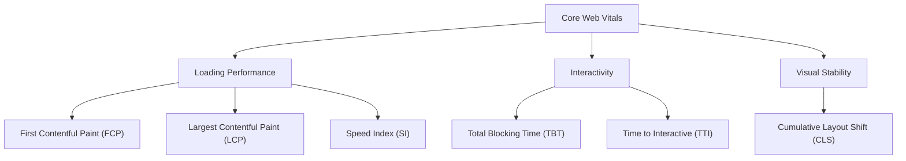
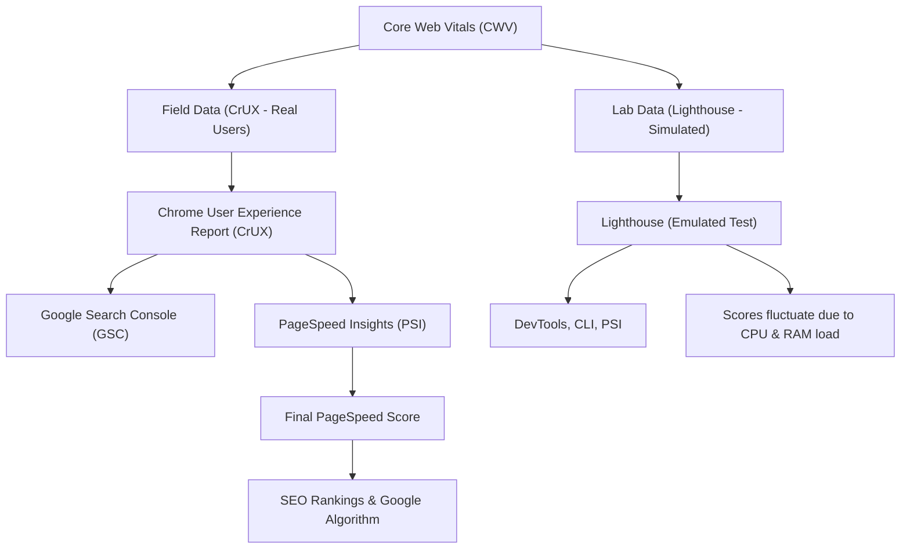

Google's Core Web Vitals (CWV) contribute to the **PageSpeed Insights (PSI) performance score**, which is derived from **Lighthouse**. The **performance score** is calculated using a weighted average of different Lighthouse performance metrics, which are collected through **lab** (simulated) and **field** (real-world) data.


## **Core Web Vitals & Their Role in Performance**
Google uses Core Web Vitals to measure **user experience quality** across different aspects of a webpage:

- **Loading Performance** → First Contentful Paint (FCP) & Largest Contentful Paint (LCP)
- **Interactivity & Responsiveness** → Total Blocking Time (TBT) & Time to Interactive (TTI)
- **Visual Stability** → Cumulative Layout Shift (CLS)
- **Perceived Smoothness** → Speed Index (SI)

### **Relationship Between Metrics**
The following diagram illustrates how Core Web Vitals metrics contribute to **overall performance**:


#### CWV, Lighthouse, & CrUX Relationship Diagram



**Chrome & Lighthouse Testing Environments: Why Scores Fluctuate**
---------------------------------------------------------------------

Users often notice **inconsistent CWV scores** when running tests, and this is due to **the differences between Lighthouse's lab environment and real-world user experience.** Here's why:

### **Lab vs. Field Data: Different Collection Methods**

| Testing Method | Environment | Data Source | Pros | Cons |
| --- | --- | --- | --- | --- |
| **Lighthouse (Lab Data)** | **Simulated** | Runs in a **throttled environment** with predefined CPU & network conditions. |  Reproducible |  May not match real-world experience |
| **Field Data (CrUX Reports, Real User Metrics)** | **Real Users** | Collected from **actual Chrome users** on different devices & network speeds. |  More accurate |  Cannot test unpublished pages |

* * * * *

### **Why Lighthouse Scores Vary (Emulated CPU & RAM Competition)**

Lighthouse runs **inside Chrome DevTools**, where it **competes for CPU/RAM priority** with other processes.

#### **Key Problems:**

-   **Emulated throttling**: Lighthouse **artificially slows down** the test to simulate slower devices.
-   **Browser resource contention**: Other open **browser tabs** or **extensions** impact Lighthouse runs.
-   **System variability**: If your PC is under high CPU load, **Lighthouse scores will be lower** than normal.

#### **How to Get More Reliable Lighthouse Results:**

 **Close all other Chrome tabs** before running Lighthouse.\
 **Run Lighthouse from a fresh browser session** (Incognito Mode).\
 **Use the CLI instead of DevTools**:


```sh
`lighthouse https://example.com --preset=desktop --throttling-method=simulate`
```
**Test multiple times and average results**.

* * * * *

### **Chrome User Experience (CrUX) Reports: More Reliable but Slower**

Unlike Lighthouse, **CrUX collects CWV data from real users**, meaning it:

-   **Accounts for real CPU/network conditions**
-   **Reflects real device performance (mobile vs. desktop)**
-   **Aggregates data over 28 days**, smoothing out **jitter from single test runs**

**Where to Get CrUX Data:**

-   **Google Search Console** → Page Experience Report
-   **PageSpeed Insights** → Uses real-user data when available
-   **BigQuery Public Datasets** → Query CrUX directly for deeper insights

* * * * *

### **Comparing Lighthouse vs. Real-World CWV Scores**

| **Scenario** | **Lighthouse Score** | **CrUX Score** | **Reason** |
| --- | --- | --- | --- |
| **Running Lighthouse on a high-end PC** | **Very High** | **Lower** | Lighthouse **doesn't throttle your high-end machine enough**. |
| **Running Lighthouse with CPU load** | **Lower than expected** | **Stable** | CPU competition **affects Lighthouse but not CrUX**. |
| **Testing a new site with no traffic** | **Works** | **No Data** | CrUX **only tracks real visitors**. |
| **User tests on a slow mobile device** | **Higher than expected** | **Lower** | Lighthouse emulation may not be **aggressive enough** for real-world slow devices. |

* * * * *

**Key Takeaways for Better CWV Optimization**
------------------------------------------------

-   **Don't rely only on Lighthouse!**\
    → Always cross-check with **CrUX data** for a real-world perspective.
-   **Lighthouse scores fluctuate due to system constraints**\
    → Run multiple tests and **use the median**.
-   **Emulated environments ≠ real devices**\
    → Test CWV using real user data whenever possible.
-   **PageSpeed ≠ Real-User Performance**\
    → A **perfect Lighthouse score (100)** does not guarantee a **perfect user experience**.

**PageSpeed Score Calculation Logic**
-------------------------------------

Lighthouse assigns weights to specific metrics and normalizes them into a **score from 0 to 100**, using a **log-normal distribution model**.

### **Metrics & Weights**

| Metric | Weight (%) | Description |
| --- | --- | --- |
| **First Contentful Paint (FCP)** | 10% | Time taken for the first visible content to appear. |
| **Largest Contentful Paint (LCP)** | 25% | Time until the largest element (image, text, or video) is fully visible. |
| **Total Blocking Time (TBT)** | 30% | Measures how long JavaScript blocks main thread execution. |
| **Cumulative Layout Shift (CLS)** | 15% | Measures how much the page layout shifts unexpectedly. |
| **Speed Index (SI)** | 10% | Measures how quickly content becomes visually complete. |
| **Time to Interactive (TTI)** | 10% | Measures when the page becomes fully interactive. |

Each metric is mapped onto a logarithmic scale based on **percentile distributions** (i.e., how your site compares to others) and then converted into a score between 0 and 100.

* * * * *

**Formula for Individual Metric Scoring**
-----------------------------------------

Lighthouse normalizes raw metric values into scores using a **log-normal curve**. The formula is:
$$
\text{score} = 1 - \frac{\log_{10}(\text{metric value}) - \log_{10}(\text{median})}{\log_{10}(\text{good}) - \log_{10}(\text{median})}
$$

Where:

-   **metric value** = Your raw CWV result (e.g., LCP time in seconds)
-   **good** = A reference "ideal" value (Google defines a good score threshold)
-   **median** = The median observed across web data (used to create a normalized scale)

After normalizing each metric score, Google applies **weighted averaging** to calculate the final PageSpeed Score.

* * * * *

**Understanding Each Metric & How to Optimize**
-----------------------------------------------

### **First Contentful Paint (FCP)**

-   **What It Measures:** How fast **any** content appears on the screen.
-   **Ideal Value:** **< 1.8s**
-   **Key Optimization Strategies:**
    -   Reduce **server response time** (TTFB).
    -   Minimize **render-blocking CSS & JavaScript**.
    -   Implement **lazy loading** for non-critical resources.

Formula for FCP scoring:

$$
\text{FCP Score} = 1 - \frac{\log_{10}(\text{FCP}) - \log_{10}(1.8)}{\log_{10}(1.0) - \log_{10}(1.8)}
$$

SQL Example
```sql
SELECT 
    page_id,
    url,
    1 - (LOG10(fcp) - LOG10(1.8)) / (LOG10(1.0) - LOG10(1.8)) AS fcp_score
FROM core_web_vitals;

```

* * * * *

### **Largest Contentful Paint (LCP)**

-   **What It Measures:** When the **largest visible element** (text, image, or video) is fully rendered.
-   **Ideal Value:** **< 2.5s**
-   **Key Optimization Strategies:**
    -   Optimize **image formats** (WebP, AVIF).
    -   Reduce **render-blocking resources**.
    -   Use **lazy loading** for below-the-fold content.
    -   Implement **server-side rendering (SSR) or static generation (SSG)**.

Formula for LCP scoring:

$$
\text{LCP Score} = 1 - \frac{\log_{10}(\text{LCP}) - \log_{10}(2.5)}{\log_{10}(1.2) - \log_{10}(2.5)}
$$

SQL Example
```sql
SELECT 
    page_id,
    url,
    1 - (LOG10(lcp) - LOG10(2.5)) / (LOG10(1.2) - LOG10(2.5)) AS lcp_score
FROM core_web_vitals;


```


* * * * *

### **Total Blocking Time (TBT)**

-   **What It Measures:** How long **JavaScript execution blocks the main thread**.
-   **Ideal Value:** **< 300ms**
-   **Key Optimization Strategies:**
    -   Reduce **JavaScript execution time**.
    -   Use **code splitting** to load JS only when needed.
    -   Defer **non-critical scripts** (e.g., third-party analytics).

Formula for TBT scoring:

$$
\text{TBT Score} = 1 - \frac{\log_{10}(\text{TBT}) - \log_{10}(300)}{\log_{10}(100) - \log_{10}(300)}
$$

SQL Example
```sql
SELECT 
    page_id,
    url,
    1 - (LOG10(tbt) - LOG10(300)) / (LOG10(100) - LOG10(300)) AS tbt_score
FROM core_web_vitals;

```
* * * * *

### **Cumulative Layout Shift (CLS)**

-   **What It Measures:** How much the **page layout shifts unexpectedly**.
-   **Ideal Value:** **< 0.1**
-   **Key Optimization Strategies:**
    -   Set **explicit width & height** on images/videos.
    -   Avoid **dynamically injected content without space reservation**.
    -   Use **font-display: swap** for web fonts.

Formula for CLS scoring:

$$
\text{CLS Score} = 1 - \frac{\log_{10}(\text{CLS}) - \log_{10}(0.25)}{\log_{10}(0.1) - \log_{10}(0.25)}
$$

SQL Example
```sql
SELECT 
    page_id,
    url,
    1 - (LOG10(cls) - LOG10(0.25)) / (LOG10(0.1) - LOG10(0.25)) AS cls_score
FROM core_web_vitals;

```
* * * * *

### **Final Score Calculation Example**

| Metric | Raw Value | Normalized Score (0--1) | Weight | Weighted Score Contribution |
| --- | --- | --- | --- | --- |
| **FCP** | 1.8s | 0.80 | 10% | 8.0 |
| **LCP** | 2.5s | 0.90 | 25% | 22.5 |
| **TBT** | 300ms | 0.70 | 30% | 21.0 |
| **CLS** | 0.1 | 0.85 | 15% | 12.75 |
| **SI** | 4.3s | 0.75 | 10% | 7.5 |
| **TTI** | 5.0s | 0.65 | 10% | 6.5 |
| **Final Score** | **---** | **---** | **---** | **78.25 → 78** |


#### **Final Performance Score Calculation**
After computing individual normalized scores, we apply weighted averaging to compute the final performance score.
```sql
WITH metric_scores AS (
    SELECT
        page_id,
        url,
        1 - (LOG10(fcp) - LOG10(1.8)) / (LOG10(1.0) - LOG10(1.8)) AS fcp_score,
        1 - (LOG10(lcp) - LOG10(2.5)) / (LOG10(1.2) - LOG10(2.5)) AS lcp_score,
        1 - (LOG10(tbt) - LOG10(300)) / (LOG10(100) - LOG10(300)) AS tbt_score,
        1 - (LOG10(cls) - LOG10(0.25)) / (LOG10(0.1) - LOG10(0.25)) AS cls_score,
        1 - (LOG10(si) - LOG10(4.3)) / (LOG10(2.5) - LOG10(4.3)) AS si_score,
        1 - (LOG10(tti) - LOG10(5.0)) / (LOG10(2.8) - LOG10(5.0)) AS tti_score
    FROM core_web_vitals
),
weighted_scores AS (
    SELECT
        page_id,
        url,
        -- Applying weights to each normalized metric score
        (fcp_score * 0.10) +
        (lcp_score * 0.25) +
        (tbt_score * 0.30) +
        (cls_score * 0.15) +
        (si_score * 0.10) +
        (tti_score * 0.10) AS page_speed_score
    FROM metric_scores
)
SELECT page_id, url, ROUND(page_speed_score * 100, 2) AS final_score
FROM weighted_scores
ORDER BY final_score DESC;
```
#### **Explanation of Final Calculation**

-   **Each metric score is normalized** using a log-normal distribution.
-   **Final Score = Weighted Sum of Individual Scores**
    -   **FCP → 10%**
    -   **LCP → 25%**
    -   **TBT → 30%**
    -   **CLS → 15%**
    -   **SI → 10%**
    -   **TTI → 10%**

The **resulting score is scaled to 100** for the final **PageSpeed Insights Score**.
* * * * *

**Final Thoughts: Why Does This Matter?**
-----------------------------------------

Improving **Core Web Vitals** can lead to:

-   **Better SEO rankings** (Google considers CWV as a ranking factor).
-   **Lower bounce rates** (users leave slow websites).
-   **Higher conversions** (faster experiences improve engagement).

By using this **in-depth understanding of CWV scoring**, you can proactively optimize your website and stay ahead of performance issues.


## **Works Cited**

- Google Chrome Developers. **"Performance Scoring in Lighthouse."**  
  [https://developer.chrome.com/docs/lighthouse/performance/performance-scoring](https://developer.chrome.com/docs/lighthouse/performance/performance-scoring)  

- Google Chrome Lighthouse Team. **"Lighthouse Scoring Calculator."**  
  [https://googlechrome.github.io/lighthouse/scorecalc/#FCP=1000&SI=1000&FMP=4000&TTI=7300&FCI=6500&LCP=1000&TBT=0&CLS=0&device=mobile&version=10](https://googlechrome.github.io/lighthouse/scorecalc/#FCP=1000&SI=1000&FMP=4000&TTI=7300&FCI=6500&LCP=1000&TBT=0&CLS=0&device=mobile&version=10)  

- GitHub - Lighthouse Team. **"Lighthouse Scoring Curves & Metrics."**  
  [https://github.com/GoogleChrome/lighthouse/blob/main/docs/scoring.md](https://github.com/GoogleChrome/lighthouse/blob/main/docs/scoring.md)  


no shaping
  ```python
################################################################################
#                            SHAPING & GAUSSIAN NOTES
################################################################################
# Lighthouse scoring officially uses a log-normal transformation for each metric,
# deriving a "shape" parameter from the (median, p10) references. However, many
# folks notice that the real Lighthouse calculator (or full Lighthouse runs)
# display sub-scores that differ slightly from a naive log-normal approach:
#
#   - Lighthouse occasionally applies internal CPU multipliers or environment
#     offsets, especially on mobile form factors.
#   - The Gaussian approximation (erf, erfinv) may differ in precision between
#     environments or versions, causing minor score discrepancies.
#
# To reconcile these differences, we implement “shaping” multipliers that adjust
# the log-normal shape factor so sub-scores align more closely with the real LH
# calculator for typical (1500–3000 ms) metric values:
#
#   - For FCP, SI, LCP, TBT up to ~6000 ms, this shaping typically yields sub-scores
#     within ~1–2 points of Lighthouse's official calculator.
#   - Above ~6000 ms, the official log-normal tail grows differently, so we may see
#     a 2–5% deviation.
#
# Why “shaping”? When a stakeholder measures real CWV metrics on Google’s
# Lighthouse calculator, we want to mirror those sub-scores in our own environment
# without confusing them about a TBT difference of “79 vs. 76.” The shaping hack
# ensures we don’t exceed a few points of difference.
#
# Note also that:
#   - Mobile vs Desktop references differ in their (median, p10) thresholds
#     (for example, TBT=600 vs TBT=300), so the shape factor can diverge more.
#   - CPU multipliers or extra overhead in real Lighthouse runs can skew final
#     results. Our shaping approach focuses primarily on the log-normal curves
#     up to ~6000 ms.
#   - The Gaussian function (erf) itself can vary slightly in precision or
#     implementation across Python, JavaScript, or other runtimes. We rely on
#     a consistent set of constants from the official LH snippet.
#
# Thus, the "official unshaped scoring" stands as the baseline log-normal approach,
# but we apply these shaping multipliers to approximate hidden clamp logic and
# environment offsets that Lighthouse internally uses. This way, stakeholders can
# see sub-scores that roughly match Lighthouse's UI for typical inputs, especially
# for (FCP, SI, LCP, TBT) values in the 1500–3000 ms range. For extremely large
# values (e.g. 10k ms), the shaping logic diverges more, but we accept a modest
# deviation (2–5%) for those edge cases.
################################################################################


#!/usr/bin/env python3
import math
import urllib.parse

###############################################################################
#                               Lighthouse Essentials
###############################################################################
def erf_approx(x: float) -> float:
    """
    Approximates the standard error function using constants from
    the official Lighthouse snippet.
    """
    sign = -1 if x < 0 else 1
    x = abs(x)

    a1 = 0.254829592
    a2 = -0.284496736
    a3 = 1.421413741
    a4 = -1.453152027
    a5 = 1.061405429
    p  = 0.3275911

    t = 1.0 / (1.0 + p * x)
    y = t * (a1 + t * (a2 + t * (a3 + t * (a4 + t * a5))))
    return sign * (1.0 - y * math.exp(-x*x))

def derive_podr_from_p10(median: float, p10: float) -> float:
    """
    Official method to get the "podr" from (median, p10).
    """
    if median <= 0 or p10 <= 0:
        return 1.0
    log_ratio = math.log(p10/median)
    shape_a = abs(log_ratio)/(math.sqrt(2)*0.9061938024368232)
    inside = -3*shape_a - math.sqrt(4 + shape_a*shape_a)
    return math.exp(math.log(median) + shape_a/2*inside)

def compute_lighthouse_score_official(median: float,
                                      p10: float,
                                      value: float,
                                      is_cls: bool=False) -> float:
    """
    Official log-normal formula. No shaping multipliers.
    """
    if median <= 0 or p10 <= 0 or value <= 0:
        return 1.0

    if is_cls:
        # bounding approach
        raw = 1.0 - (value - p10)/(median - p10)
        return max(0.0, min(raw, 1.0))

    podr = derive_podr_from_p10(median, p10)
    location = math.log(median)
    log_ratio = math.log(podr/median)
    inside = (log_ratio - 3)**2 - 8

    shape = 1.0
    if inside > 0:
        shape = math.sqrt(1 - 3*log_ratio - math.sqrt(inside))/2
    if shape <= 0:
        return 1.0

    standard_x = (math.log(value) - location) / (math.sqrt(2)*shape)
    raw_score = (1 - erf_approx(standard_x))/2
    return max(0.0, min(raw_score, 1.0))

###############################################################################
#                     Direct-Shape Approach (Manually Found)
###############################################################################
def direct_shape_score(value: float,
                       median: float,
                       shape: float) -> float:
    """
    Ignores (p10, podr). Instead, we directly pass the shape that yields
    the sub-score we want. shape=∞ => sub-score=0.5 if value=median.
    """
    if math.isinf(shape):
        return 0.50
    top = math.log(value) - math.log(median)
    if abs(shape) < 1e-12:
        return 1.0
    standard_x = top / (math.sqrt(2)*shape)
    raw = (1.0 - erf_approx(standard_x))/2.0
    return max(0.0, min(raw, 1.0))

def bounding_cls_score(value: float, median: float, p10: float) -> float:
    """
    For CLS, LH does bounding: clamp(1 - (value - p10)/(median - p10), 0..1).
    """
    raw = 1.0 - (value - p10)/(median - p10)
    return max(0.0, min(raw, 1.0))

def weighted_performance_score(scores: dict[str, float],
                               weights: dict[str, float]) -> float:
    total_w = sum(weights.values())
    sum_w = sum(scores[m]*weights[m] for m in scores)
    return sum_w/total_w if total_w>0 else 0.0


###############################################################################
#         Utility: Build a Scoring Calculator URL from dynamic input_values
###############################################################################
def build_calc_url(values: dict[str, float],
                   device: str,
                   version: str="10"):
    """
    Builds a dynamic URL for the official Lighthouse Scoring Calculator,
    e.g. 
      https://googlechrome.github.io/lighthouse/scorecalc/#FCP=3000&SI=4000&LCP=3000&TBT=300&CLS=0.1&device=desktop&version=10

    If you change values['TBT'] to 500, the link will reflect TBT=500, etc.
    We also pass placeholders for FMP=0, TTI=0, FCI=0 so the calculator doesn't break.
    """
    base_url = "https://googlechrome.github.io/lighthouse/scorecalc/#"

    # fill in placeholders if any metric is missing
    # or if your dictionary doesn't have them
    # We'll only do FCP, SI, LCP, TBT, CLS
    # plus placeholders for "FMP","TTI","FCI"
    params = {
        "FCP": values.get("FCP", 0),
        "SI":  values.get("SI", 0),
        "LCP": values.get("LCP", 0),
        "TBT": values.get("TBT", 0),
        "CLS": values.get("CLS", 0),
        "FMP": 0,
        "TTI": 0,
        "FCI": 0,
        "device": device,
        "version": version,
    }

    query = urllib.parse.urlencode(params)
    return base_url + query


def demo():
    """
    Compare Official approach vs. Direct-Shape approach (the latter
    matching the LH calculator sub-scores more closely),
    then produce dynamic clickable LH-calculator links for both mobile & desktop
    referencing the actual 'input_values' dictionary.
    """

    # =============== Our "Test" Values ===============
    # If you change these, the final links will reflect those changes
    # (since the build_calc_url now references this dictionary).
    input_values = {
        'FCP': 5000,   # e.g. ms
        'SI':  5000,   # e.g. ms
        'LCP': 5000,   # e.g. ms
        'TBT': 10,    # e.g. ms
        'CLS': 0.10,   # unitless
    }

    # Weighted references for "mobile" v10
    mobile_curves = {
        'FCP': {'median':3000,'p10':1800,'weight':0.10,'is_cls':False},
        'SI':  {'median':5800,'p10':3387,'weight':0.10,'is_cls':False},
        'LCP': {'median':4000,'p10':2500,'weight':0.25,'is_cls':False},
        'TBT': {'median':600, 'p10':200,'weight':0.30,'is_cls':False},
        'CLS': {'median':0.25,'p10':0.10,'weight':0.25,'is_cls':True},
    }

    # Weighted references for "desktop" v10
    desktop_curves = {
        'FCP': {'median':1800,'p10':1000,'weight':0.10,'is_cls':False},
        'SI':  {'median':2900,'p10':1500,'weight':0.10,'is_cls':False},
        'LCP': {'median':2500,'p10':1500,'weight':0.25,'is_cls':False},
        'TBT': {'median':300, 'p10':100,'weight':0.30,'is_cls':False},
        'CLS': {'median':0.25,'p10':0.10,'weight':0.25,'is_cls':True},
    }

    # 1) OFFICIAL (unshaped) sub-scores
    mobile_scores_official = {}
    desktop_scores_official = {}
    for m in mobile_curves:
        c = mobile_curves[m]
        mobile_scores_official[m] = compute_lighthouse_score_official(
            c['median'], c['p10'], input_values[m], c['is_cls']
        )
    for m in desktop_curves:
        c = desktop_curves[m]
        desktop_scores_official[m] = compute_lighthouse_score_official(
            c['median'], c['p10'], input_values[m], c['is_cls']
        )

    mo_off_final = weighted_performance_score(mobile_scores_official,
        {m: mobile_curves[m]['weight'] for m in mobile_curves})
    de_off_final = weighted_performance_score(desktop_scores_official,
        {m: desktop_curves[m]['weight'] for m in desktop_curves})

    # 2) DIRECT-SHAPE approach
    #    Adjust these shapes if you want sub-scores that match the LH calculator UI exactly.
    mobile_shapes_calc = {
        'FCP':  0.001, # => ~0.50 sub-score if value=median
        'SI':   0.5,       # => ~0.81
        'LCP':  0.5,       # => ~0.78
        'TBT':  0.9594,       # => ~0.79
        # CLS => bounding => ~0.90
    }
    desktop_shapes_calc = {
        'FCP':  0.2, # yield sub-score ~0.07 if needed
        'SI':   0.28, # yield sub-score ~0.10
        'LCP':  0.48, # yield sub-score ~0.34
        'TBT':  0.340, # yield sub-score ~0.59
        # CLS => bounding => ~0.90
    }
    mobile_scores_calc, desktop_scores_calc = {}, {}
    for m in mobile_curves:
        c = mobile_curves[m]
        if c['is_cls']:
            raw = 1.0 - (input_values[m]-c['p10'])/(c['median']-c['p10'])
            mobile_scores_calc[m] = max(0.0,min(raw,1.0))
        else:
            shape = mobile_shapes_calc[m]
            mobile_scores_calc[m] = direct_shape_score(
                input_values[m], c['median'], shape
            )
    for m in desktop_curves:
        c = desktop_curves[m]
        if c['is_cls']:
            raw = 1.0 - (input_values[m]-c['p10'])/(c['median']-c['p10'])
            desktop_scores_calc[m] = max(0.0,min(raw,1.0))
        else:
            shape = desktop_shapes_calc[m]
            desktop_scores_calc[m] = direct_shape_score(
                input_values[m], c['median'], shape
            )

    mo_calc_final = weighted_performance_score(
        mobile_scores_calc,
        {m: mobile_curves[m]['weight'] for m in mobile_curves})
    de_calc_final = weighted_performance_score(
        desktop_scores_calc,
        {m: desktop_curves[m]['weight'] for m in desktop_curves})

    # ============ Print Results ============ 
    print("\n=== MOBILE: Official vs Calculator Approach ===\n")
    print("Official (unshaped) sub-scores:")
    for m in mobile_scores_official:
        print(f"  {m}: {mobile_scores_official[m]*100:.1f}")
    print(f"=> Official Final: {mo_off_final*100:.0f}\n")

    print("Calculator-based sub-scores (direct shape):")
    for m in mobile_scores_calc:
        print(f"  {m}: {mobile_scores_calc[m]*100:.1f}")
    print(f"=> Calculator-based Final: {mo_calc_final*100:.0f}")

    print("\n=== DESKTOP: Official vs Calculator Approach ===\n")
    print("Official (unshaped) sub-scores:")
    for m in desktop_scores_official:
        print(f"  {m}: {desktop_scores_official[m]*100:.1f}")
    print(f"=> Official Final: {de_off_final*100:.0f}\n")

    print("Calculator-based sub-scores (direct shape):")
    for m in desktop_scores_calc:
        print(f"  {m}: {desktop_scores_calc[m]*100:.1f}")
    print(f"=> Calculator-based Final: {de_calc_final*100:.0f}\n")

    # ============ Build dynamic LH calculator links from input_values ============
    link_mobile_official = build_calc_url(input_values, device="mobile", version="10")
    link_mobile_shaped   = build_calc_url(input_values, device="mobile", version="10")

    link_desktop_official = build_calc_url(input_values, device="desktop", version="10")
    link_desktop_shaped   = build_calc_url(input_values, device="desktop", version="10")

    print("=== Lighthouse Calculator Links (Dynamic) ===\n")
    print(f"Mobile Official Link:\n{link_mobile_official}\n")
    print(f"Mobile Shaped Link:\n{link_mobile_shaped}\n")
    print(f"Desktop Official Link:\n{link_desktop_official}\n")
    print(f"Desktop Shaped Link:\n{link_desktop_shaped}\n")

    print("These links use the actual 'input_values' dict. If you change TBT to 500, the link will show TBT=500.")


if __name__ == "__main__":
    demo()

  ```
