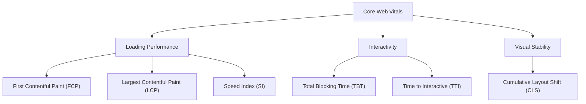
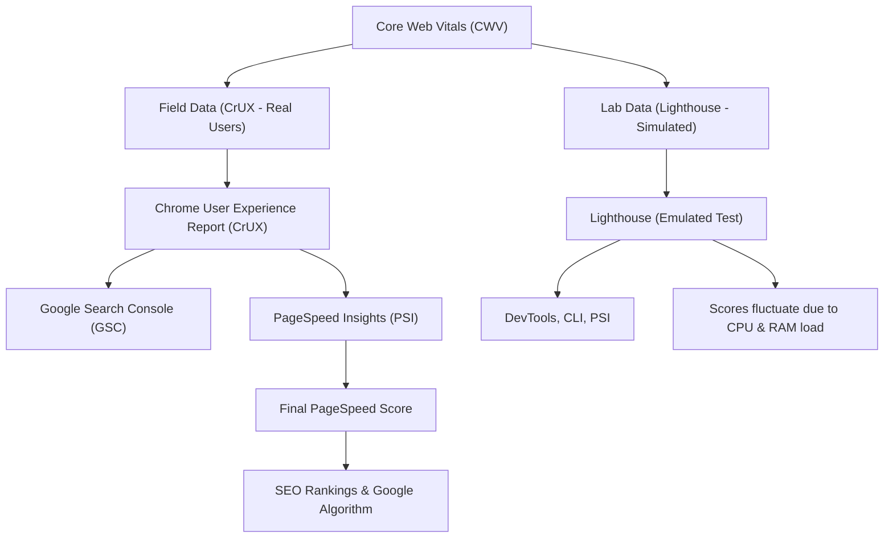

Google's Core Web Vitals (CWV) contribute to the **PageSpeed Insights (PSI) performance score**, which is derived from **Lighthouse**. The **performance score** is calculated using a weighted average of different Lighthouse performance metrics, which are collected through **lab** (simulated) and **field** (real-world) data.


## **Core Web Vitals & Their Role in Performance**
Google uses Core Web Vitals to measure **user experience quality** across different aspects of a webpage:

- **Loading Performance** → First Contentful Paint (FCP) & Largest Contentful Paint (LCP)
- **Interactivity & Responsiveness** → Total Blocking Time (TBT) & Time to Interactive (TTI)
- **Visual Stability** → Cumulative Layout Shift (CLS)
- **Perceived Smoothness** → Speed Index (SI)

### **Relationship Between Metrics**
The following diagram illustrates how Core Web Vitals metrics contribute to **overall performance**:


#### CWV, Lighthouse, & CrUX Relationship Diagram



**Chrome & Lighthouse Testing Environments: Why Scores Fluctuate**
---------------------------------------------------------------------

Users often notice **inconsistent CWV scores** when running tests, and this is due to **the differences between Lighthouse's lab environment and real-world user experience.** Here's why:

### **Lab vs. Field Data: Different Collection Methods**

| Testing Method | Environment | Data Source | Pros | Cons |
| --- | --- | --- | --- | --- |
| **Lighthouse (Lab Data)** | **Simulated** | Runs in a **throttled environment** with predefined CPU & network conditions. | ✅ Reproducible | ❌ May not match real-world experience |
| **Field Data (CrUX Reports, Real User Metrics)** | **Real Users** | Collected from **actual Chrome users** on different devices & network speeds. | ✅ More accurate | ❌ Cannot test unpublished pages |

* * * * *

### **Why Lighthouse Scores Vary (Emulated CPU & RAM Competition)**

Lighthouse runs **inside Chrome DevTools**, where it **competes for CPU/RAM priority** with other processes.

#### **Key Problems:**

-   **Emulated throttling**: Lighthouse **artificially slows down** the test to simulate slower devices.
-   **Browser resource contention**: Other open **browser tabs** or **extensions** impact Lighthouse runs.
-   **System variability**: If your PC is under high CPU load, **Lighthouse scores will be lower** than normal.

#### **How to Get More Reliable Lighthouse Results:**

✅ **Close all other Chrome tabs** before running Lighthouse.\
✅ **Run Lighthouse from a fresh browser session** (Incognito Mode).\
✅ **Use the CLI instead of DevTools**:


```sh
`lighthouse https://example.com --preset=desktop --throttling-method=simulate`
```
**Test multiple times and average results**.

* * * * *

### **Chrome User Experience (CrUX) Reports: More Reliable but Slower**

Unlike Lighthouse, **CrUX collects CWV data from real users**, meaning it:

-   **Accounts for real CPU/network conditions**
-   **Reflects real device performance (mobile vs. desktop)**
-   **Aggregates data over 28 days**, smoothing out **jitter from single test runs**

**Where to Get CrUX Data:**

-   **Google Search Console** → Page Experience Report
-   **PageSpeed Insights** → Uses real-user data when available
-   **BigQuery Public Datasets** → Query CrUX directly for deeper insights

* * * * *

### **Comparing Lighthouse vs. Real-World CWV Scores**

| **Scenario** | **Lighthouse Score** | **CrUX Score** | **Reason** |
| --- | --- | --- | --- |
| **Running Lighthouse on a high-end PC** | **Very High** | **Lower** | Lighthouse **doesn't throttle your high-end machine enough**. |
| **Running Lighthouse with CPU load** | **Lower than expected** | **Stable** | CPU competition **affects Lighthouse but not CrUX**. |
| **Testing a new site with no traffic** | **Works** | **No Data** | CrUX **only tracks real visitors**. |
| **User tests on a slow mobile device** | **Higher than expected** | **Lower** | Lighthouse emulation may not be **aggressive enough** for real-world slow devices. |

* * * * *

**Key Takeaways for Better CWV Optimization**
------------------------------------------------

-   **Don't rely only on Lighthouse!**\
    → Always cross-check with **CrUX data** for a real-world perspective.
-   **Lighthouse scores fluctuate due to system constraints**\
    → Run multiple tests and **use the median**.
-   **Emulated environments ≠ real devices**\
    → Test CWV using real user data whenever possible.
-   **PageSpeed ≠ Real-User Performance**\
    → A **perfect Lighthouse score (100)** does not guarantee a **perfect user experience**.

**PageSpeed Score Calculation Logic**
-------------------------------------

Lighthouse assigns weights to specific metrics and normalizes them into a **score from 0 to 100**, using a **log-normal distribution model**.

### **Metrics & Weights**

| Metric | Weight (%) | Description |
| --- | --- | --- |
| **First Contentful Paint (FCP)** | 10% | Time taken for the first visible content to appear. |
| **Largest Contentful Paint (LCP)** | 25% | Time until the largest element (image, text, or video) is fully visible. |
| **Total Blocking Time (TBT)** | 30% | Measures how long JavaScript blocks main thread execution. |
| **Cumulative Layout Shift (CLS)** | 15% | Measures how much the page layout shifts unexpectedly. |
| **Speed Index (SI)** | 10% | Measures how quickly content becomes visually complete. |
| **Time to Interactive (TTI)** | 10% | Measures when the page becomes fully interactive. |

Each metric is mapped onto a logarithmic scale based on **percentile distributions** (i.e., how your site compares to others) and then converted into a score between 0 and 100.

* * * * *

**Formula for Individual Metric Scoring**
-----------------------------------------

Lighthouse normalizes raw metric values into scores using a **log-normal curve**. The formula is:
$$
\text{score} = 1 - \frac{\log_{10}(\text{metric value}) - \log_{10}(\text{median})}{\log_{10}(\text{good}) - \log_{10}(\text{median})}
$$

Where:

-   **metric value** = Your raw CWV result (e.g., LCP time in seconds)
-   **good** = A reference "ideal" value (Google defines a good score threshold)
-   **median** = The median observed across web data (used to create a normalized scale)

After normalizing each metric score, Google applies **weighted averaging** to calculate the final PageSpeed Score.

* * * * *

**Understanding Each Metric & How to Optimize**
-----------------------------------------------

### **First Contentful Paint (FCP)**

-   **What It Measures:** How fast **any** content appears on the screen.
-   **Ideal Value:** **< 1.8s**
-   **Key Optimization Strategies:**
    -   Reduce **server response time** (TTFB).
    -   Minimize **render-blocking CSS & JavaScript**.
    -   Implement **lazy loading** for non-critical resources.

Formula for FCP scoring:

$$
\text{FCP Score} = 1 - \frac{\log_{10}(\text{FCP}) - \log_{10}(1.8)}{\log_{10}(1.0) - \log_{10}(1.8)}
$$

SQL Example
```sql
SELECT 
    page_id,
    url,
    1 - (LOG10(fcp) - LOG10(1.8)) / (LOG10(1.0) - LOG10(1.8)) AS fcp_score
FROM core_web_vitals;

```

* * * * *

### **Largest Contentful Paint (LCP)**

-   **What It Measures:** When the **largest visible element** (text, image, or video) is fully rendered.
-   **Ideal Value:** **< 2.5s**
-   **Key Optimization Strategies:**
    -   Optimize **image formats** (WebP, AVIF).
    -   Reduce **render-blocking resources**.
    -   Use **lazy loading** for below-the-fold content.
    -   Implement **server-side rendering (SSR) or static generation (SSG)**.

Formula for LCP scoring:

$$
\text{LCP Score} = 1 - \frac{\log_{10}(\text{LCP}) - \log_{10}(2.5)}{\log_{10}(1.2) - \log_{10}(2.5)}
$$

SQL Example
```sql
SELECT 
    page_id,
    url,
    1 - (LOG10(lcp) - LOG10(2.5)) / (LOG10(1.2) - LOG10(2.5)) AS lcp_score
FROM core_web_vitals;


```


* * * * *

### **Total Blocking Time (TBT)**

-   **What It Measures:** How long **JavaScript execution blocks the main thread**.
-   **Ideal Value:** **< 300ms**
-   **Key Optimization Strategies:**
    -   Reduce **JavaScript execution time**.
    -   Use **code splitting** to load JS only when needed.
    -   Defer **non-critical scripts** (e.g., third-party analytics).

Formula for TBT scoring:

$$
\text{TBT Score} = 1 - \frac{\log_{10}(\text{TBT}) - \log_{10}(300)}{\log_{10}(100) - \log_{10}(300)}
$$

SQL Example
```sql
SELECT 
    page_id,
    url,
    1 - (LOG10(tbt) - LOG10(300)) / (LOG10(100) - LOG10(300)) AS tbt_score
FROM core_web_vitals;

```
* * * * *

### **Cumulative Layout Shift (CLS)**

-   **What It Measures:** How much the **page layout shifts unexpectedly**.
-   **Ideal Value:** **< 0.1**
-   **Key Optimization Strategies:**
    -   Set **explicit width & height** on images/videos.
    -   Avoid **dynamically injected content without space reservation**.
    -   Use **font-display: swap** for web fonts.

Formula for CLS scoring:

$$
\text{CLS Score} = 1 - \frac{\log_{10}(\text{CLS}) - \log_{10}(0.25)}{\log_{10}(0.1) - \log_{10}(0.25)}
$$

SQL Example
```sql
SELECT 
    page_id,
    url,
    1 - (LOG10(cls) - LOG10(0.25)) / (LOG10(0.1) - LOG10(0.25)) AS cls_score
FROM core_web_vitals;

```
* * * * *

### **Final Score Calculation Example**

| Metric | Raw Value | Normalized Score (0--1) | Weight | Weighted Score Contribution |
| --- | --- | --- | --- | --- |
| **FCP** | 1.8s | 0.80 | 10% | 8.0 |
| **LCP** | 2.5s | 0.90 | 25% | 22.5 |
| **TBT** | 300ms | 0.70 | 30% | 21.0 |
| **CLS** | 0.1 | 0.85 | 15% | 12.75 |
| **SI** | 4.3s | 0.75 | 10% | 7.5 |
| **TTI** | 5.0s | 0.65 | 10% | 6.5 |
| **Final Score** | **---** | **---** | **---** | **78.25 → 78** |


#### **Final Performance Score Calculation**
After computing individual normalized scores, we apply weighted averaging to compute the final performance score.
```sql
WITH metric_scores AS (
    SELECT
        page_id,
        url,
        1 - (LOG10(fcp) - LOG10(1.8)) / (LOG10(1.0) - LOG10(1.8)) AS fcp_score,
        1 - (LOG10(lcp) - LOG10(2.5)) / (LOG10(1.2) - LOG10(2.5)) AS lcp_score,
        1 - (LOG10(tbt) - LOG10(300)) / (LOG10(100) - LOG10(300)) AS tbt_score,
        1 - (LOG10(cls) - LOG10(0.25)) / (LOG10(0.1) - LOG10(0.25)) AS cls_score,
        1 - (LOG10(si) - LOG10(4.3)) / (LOG10(2.5) - LOG10(4.3)) AS si_score,
        1 - (LOG10(tti) - LOG10(5.0)) / (LOG10(2.8) - LOG10(5.0)) AS tti_score
    FROM core_web_vitals
),
weighted_scores AS (
    SELECT
        page_id,
        url,
        -- Applying weights to each normalized metric score
        (fcp_score * 0.10) +
        (lcp_score * 0.25) +
        (tbt_score * 0.30) +
        (cls_score * 0.15) +
        (si_score * 0.10) +
        (tti_score * 0.10) AS page_speed_score
    FROM metric_scores
)
SELECT page_id, url, ROUND(page_speed_score * 100, 2) AS final_score
FROM weighted_scores
ORDER BY final_score DESC;
```
#### **Explanation of Final Calculation**

-   **Each metric score is normalized** using a log-normal distribution.
-   **Final Score = Weighted Sum of Individual Scores**
    -   **FCP → 10%**
    -   **LCP → 25%**
    -   **TBT → 30%**
    -   **CLS → 15%**
    -   **SI → 10%**
    -   **TTI → 10%**

The **resulting score is scaled to 100** for the final **PageSpeed Insights Score**.
* * * * *

**Final Thoughts: Why Does This Matter?**
-----------------------------------------

Improving **Core Web Vitals** can lead to:

-   **Better SEO rankings** (Google considers CWV as a ranking factor).
-   **Lower bounce rates** (users leave slow websites).
-   **Higher conversions** (faster experiences improve engagement).

By using this **in-depth understanding of CWV scoring**, you can proactively optimize your website and stay ahead of performance issues.